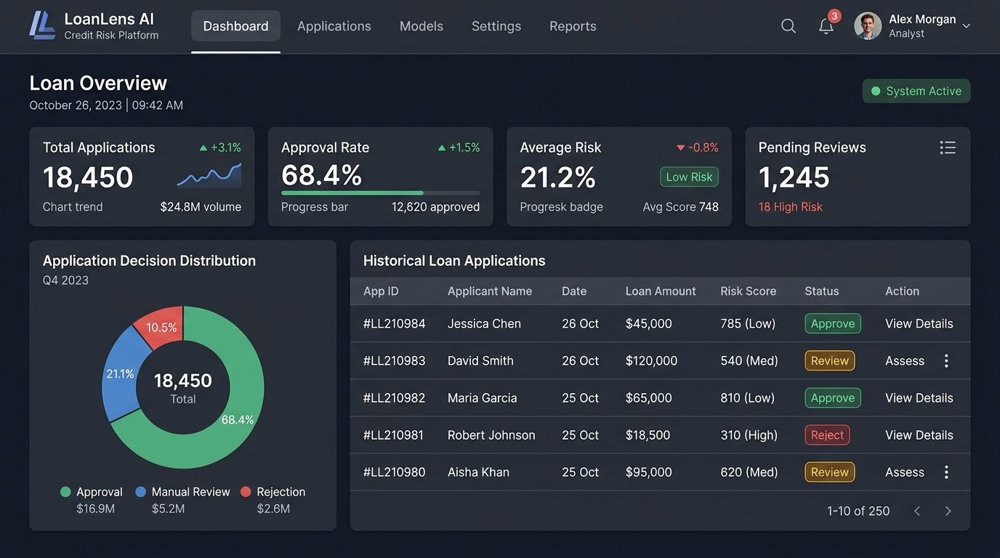
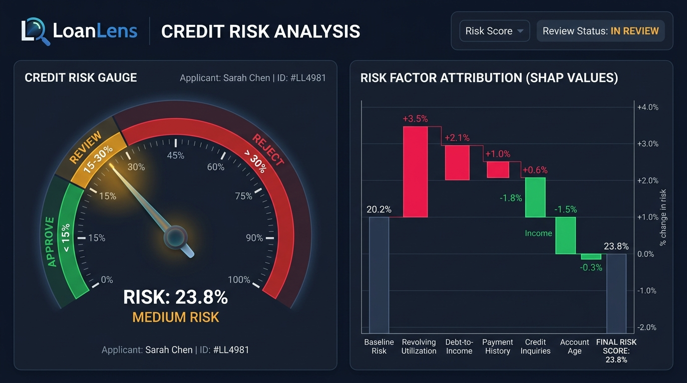
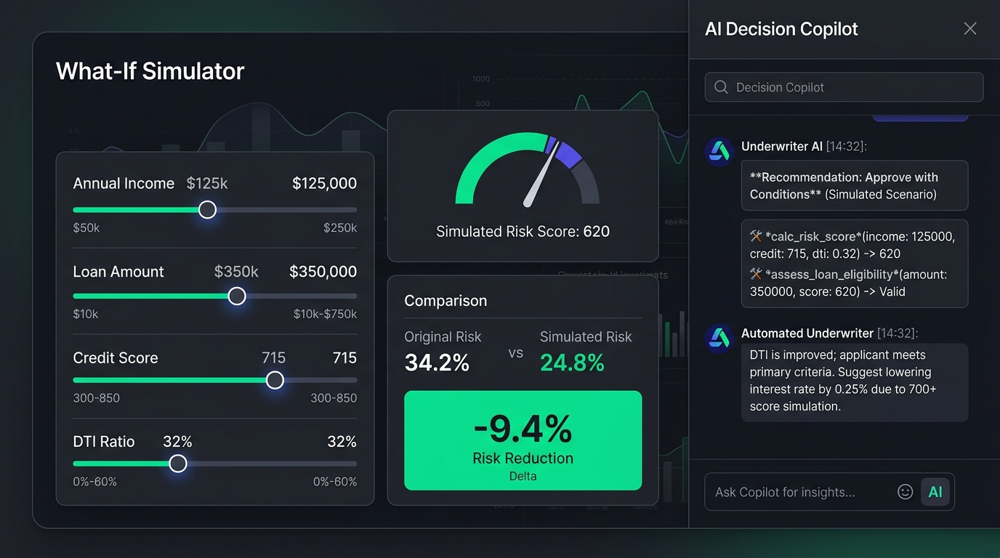

# 🏦 LoanLens: Explainable AI Loan Risk & Underwriting Platform

[](https://www.python.org/)
[](https://xgboost.readthedocs.io/)
[](https://shap.readthedocs.io/)
[](https://fastapi.tiangolo.com/)
[](https://react.dev/)
[](https://tailwindcss.com/)
[](LICENSE)

> **An audit-ready, interpretable machine learning system for loan underwriting.** LoanLens combines gradient boosted decision trees (**XGBoost**) with game-theoretic feature attributions (**SHAP TreeExplainer**) in calibrated probability space to produce transparent, compliant credit decisions and interactive counterfactual what-if simulations.

---

## 📸 Visual Interface Tour

### 1. Portfolio Underwriting Dashboard
Executive monitoring overview displaying real-time portfolio metrics, 3-tier risk policy guidelines, decision distribution charts, and recent applications.



---

### 2. Decision Analysis & Explainable SHAP Attribution
High-precision 180° Risk Gauge paired with a mathematical SHAP Waterfall chart that maps positive and negative feature contributions against institutional baseline risk (43.36%).



---

### 3. Interactive What-If Simulator & AI Copilot
Real-time counterfactual simulation sliders allowing underwriters to test debt consolidation or income shifts, paired with an AI Decision Copilot executing autonomous underwriting tools.



---

## ✨ Core Features

* **🛡️ Strictly Leakage-Free Pre-Origination Pipeline:**
  Trained solely on attributes accessible on Day 1 of loan application (FICO, DTI, Loan-to-Income, Revolving Utilization). Excludes post-origination leakage features (e.g., late fees, payment history).
* **📊 Semicircular 180° Visual Risk Gauge:**
  Smoothly animated gauge with real-time needle tracking and color-coded policy bands:
  * **Approve (0% – 15% Risk):** Prime tier, automatic approval.
  * **Review (15% – 30% Risk):** Near-prime tier, manual human-in-the-loop audit.
  * **Reject (> 30% Risk):** Subprime tier, adverse action required.
* **🔍 Probability-Space SHAP Feature Attribution:**
  Unlike typical explainers that output abstract log-odds margin values, LoanLens translates SHAP attributions directly into intuitive probability percentages (e.g., *“DTI (+8.2%) increased default risk, while Credit Score (-4.5%) mitigated it”*).
* **🎛️ Counterfactual What-If Sensitivity Engine:**
  Interactive sliders allow loan officers to simulate financial adjustments (e.g., increasing income, paying down revolving credit, lowering requested loan amount) and visualize instantaneous decision threshold changes.
* **📜 Regulatory Adverse Action Notice Generator:**
  Automatically formats top risk drivers into legally compliant statements aligned with the **Fair Credit Reporting Act (FCRA)** and **Equal Credit Opportunity Act (ECOA)**.
* **🤖 Autonomous AI Underwriting Copilot:**
  Slide-over assistant drawer that utilizes structured tool calling (`get_application`, `explain_decision`, `run_what_if`, `search_similar_applications`) to answer inquiries, compare historical peers, and draft governance memos.
* **🗄️ SQLite Audit Trail & CSV Governance:**
  Every application evaluation is permanently logged in a local SQLite database (`backend/loanlens.db`) with one-click CSV export for internal compliance and regulatory audits.

---

## 🛠️ Technology Stack

| Layer | Technologies | Role |
| :--- | :--- | :--- |
| **Machine Learning** | `XGBoost`, `Scikit-Learn`, `Pandas`, `NumPy`, `Joblib` | Gradient boosting classifier for binary default prediction |
| **Explainable AI (XAI)** | `SHAP (TreeExplainer)` | Cooperative game theory Shapley feature attributions ($O(TLD^2)$) |
| **Backend API** | `FastAPI`, `Uvicorn`, `Pydantic` | High-performance Python REST API with automatic OpenAPI Swagger docs |
| **Application Server** | `Node.js`, `Express 5` | Universal, cross-platform full-stack server with embedded underwriting engine |
| **Frontend UI** | `React 19`, `Vite`, `Tailwind CSS v4` | Single-page application with responsive layouts and component architecture |
| **Data Visualization** | `Recharts`, `Lucide React` | SVG-based risk gauges, waterfall bar charts, and portfolio donuts |
| **Database** | `SQLite 3` | Persistent relational storage for application records and audit trails |

---

## 🚀 Getting Started

### Prerequisites
* **Node.js** (v18.x or higher)
* **Python** (v3.10 or v3.11, *optional for running Python FastAPI backend*)
* **Git**

---

### Option A: Quick Start (Node.js All-in-One Mode)
*Fastest setup on Windows, macOS, or Linux without installing Python packages.*

```bash
# 1. Clone the repository
git clone https://github.com/your-username/loanlens.git
cd loanlens

# 2. Install dependencies
npm install

# 3. Build the frontend
npm run build

# 4. Start the application
npm start
```
Open **`http://localhost:3000`** in your web browser.

---

### Option B: Live Python ML Mode (FastAPI + XGBoost)
*Ideal for academic defense or ML demonstrations running real Python code.*

#### 1. Start the FastAPI Machine Learning Backend:
```bash
cd backend
pip install -r requirements.txt
uvicorn main:app --port 8000 --reload
```
* Interactive API Documentation (Swagger): **`http://localhost:8000/docs`**
* Health Endpoint: **`http://localhost:8000/health`**

#### 2. Start the Frontend Dev Server:
In a second terminal:
```bash
cd frontend
npm install
npm run dev
```
Open **`http://localhost:5173`** (or the port displayed by Vite).

---

## 🧠 Model Training & Pipeline

The project includes an end-to-end training pipeline configured for the **LendingClub Dataset** (~1.8 million accepted loans).

```bash
# Navigate to the backend directory
cd backend

# Execute training pipeline
python model.py
```

### Training Configuration (`backend/model.py`)
* **Quick Dev Run (~2–4 minutes):** Set `SAMPLE_SIZE = 200000` (trains on 200k rows).
* **Full Production Run (~15–30 minutes):** Set `SAMPLE_SIZE = None` (trains on the entire dataset).

### Exported Artifacts:
Upon completion, the script automatically exports the following artifacts into `backend/models/`:
* `xgb_model.pkl`: Serialized XGBoost booster weights.
* `categorical_encoder.pkl`: Ordinal encoders for categorical variables.
* `feature_columns.pkl`: Ordered feature schema definition.
* `feature_config.json`: Feature boundary parameters and mappings.
* `background_sample.csv`: 100 representative instances for SHAP TreeExplainer baseline.
* `model_metadata.json`: ROC-AUC, PR-AUC, accuracy, and training timestamp.

---

## 📐 Mathematical & Explainability Methodology

### 1. Game-Theoretic Additive Attribution (SHAP)
SHAP guarantees fairness in credit explanation through Shapley values:
$$\phi_i(x) = \sum_{S \subseteq F \setminus \{i\}} \frac{|S|!(|F| - |S| - 1)!}{|F|!} \left[ f_x(S \cup \{i\}) - f_x(S) \right]$$

* **Efficiency:** The sum of feature contributions plus base risk equals the predicted score:
  $$f(x) = \mathbb{E}[f(X)] + \sum_{i=1}^M \phi_i$$
* **Population Base Risk ($\mathbb{E}[f(X)]$):** Calibrated to **43.36%** based on the LendingClub sample distribution.

### 2. Decoupled 3-Tier Policy
```
  0% ──────────── 15% ──────────────────────── 30% ──────────── 100%
  │   APPROVE      │          REVIEW            │     REJECT      │
  │  (Prime Tier)  │   (Underwriter Review)     │ (Adverse Action)│
```
Decoupling default risk modeling from risk policy enables financial institutions to adapt lending strategies without invalidating or retraining underlying ML models.

---

## 📂 Project Structure

```text
LoanLens/
├── backend/
│   ├── models/                   # Serialized XGBoost & SHAP artifacts (.pkl, .json)
│   ├── explainer.py              # RiskExplainer class with TreeExplainer wrapper
│   ├── model.py                  # Full data cleaning & XGBoost training pipeline
│   ├── main.py                   # FastAPI REST API application
│   ├── loanlens.db               # SQLite audit database
│   └── requirements.txt          # Python library dependencies
├── frontend/
│   ├── src/
│   │   ├── components/           # RiskGauge, ShapChart, WhatIfSimulator, AiAssistantDrawer
│   │   ├── pages/                # Dashboard, DecisionAnalysis, NewApplication, Insights, AuditHistory
│   │   ├── api.js                # Unified API client & offline fallback engine
│   │   ├── App.jsx               # Navigation router & state provider
│   │   └── main.jsx              # React entry point
│   ├── package.json              # Frontend dependencies
│   └── vite.config.js            # Vite build configuration
├── screenshots/                  # Documentation UI screenshots
├── server.js                     # Universal cross-platform Node.js server
├── server.ts                     # TypeScript server definition
├── metadata.json                 # AI Studio metadata definition
├── package.json                  # Root build and run scripts
└── README.md                     # Comprehensive project documentation
```

---

## ⚖️ Regulatory Compliance & Ethics

* **Fair Credit Reporting Act (FCRA):** Automatically populates adverse action notices citing exact, quantitative principal factors for credit denial.
* **Equal Credit Opportunity Act (ECOA):** Ensures model inputs exclude protected classes (race, color, religion, national origin, sex, marital status, age).
* **Supervisory Guidance on Model Risk Management (SR 11-7):** Built-in audit trail and governance tables satisfy validation, transparency, and ongoing monitoring mandates.

---

## 📄 License
This project is open-source and available under the [MIT License](LICENSE).
